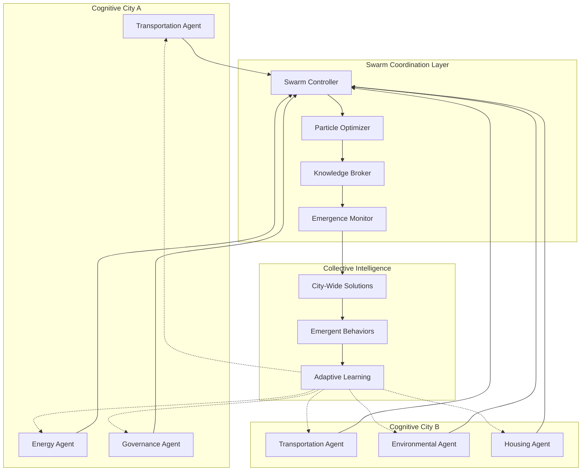

# 🐝 Cognitive Swarms - Particle Swarm Accelerator

> **Note2Self (@copilot)**: The particle swarm accelerator represents the collective intelligence layer of cognitive cities. Just as swarms in nature exhibit emergent intelligence greater than individual components, cognitive cities achieve urban intelligence through coordinated AI agents working together. This is where the magic of distributed cognition really happens.

## Overview

The Cognitive Swarms module implements particle swarm optimization algorithms for coordinating multiple AI agents within and across cognitive cities. This creates emergent behaviors and collective intelligence that enables cities to solve complex urban problems that no single AI system could handle alone.

## Architecture



## Particle Swarm Principles

### 1. Individual Particles (AI Agents)
Each AI agent in the cognitive city acts as a particle with:
- **Position**: Current solution/state in the problem space
- **Velocity**: Rate and direction of change in approach
- **Personal Best**: Best solution found by this agent
- **Neighborhood**: Other agents it directly communicates with

### 2. Swarm Dynamics
The collective behavior emerges from simple rules:
- **Cognitive Attraction**: Move toward better solutions found by neighbors
- **Social Learning**: Share successful strategies with connected agents
- **Exploration vs Exploitation**: Balance trying new approaches vs refining good ones
- **Adaptive Topology**: Change communication patterns based on problem requirements

### 3. Global Optimization
The swarm collectively searches for optimal solutions:
- **Global Best**: Best solution found by any particle in the swarm
- **Convergence Criteria**: When to stop searching and implement solutions
- **Diversity Maintenance**: Prevent premature convergence on suboptimal solutions
- **Multi-Objective**: Handle competing urban objectives simultaneously

## Urban Applications

### Traffic Flow Optimization
```python
# Example: Coordinated traffic light optimization across city districts
class TrafficSwarmParticle:
    def __init__(self, intersection_id):
        self.intersection_id = intersection_id
        self.current_timing = initialize_timing()
        self.velocity = initialize_velocity()
        self.personal_best = None
        self.neighbors = get_adjacent_intersections()
    
    def update_position(self, global_best, neighborhood_best):
        # Update traffic light timing based on swarm intelligence
        cognitive_component = self.personal_best - self.current_timing
        social_component = neighborhood_best - self.current_timing
        global_component = global_best - self.current_timing
        
        self.velocity = (
            0.4 * self.velocity +           # Inertia
            0.2 * cognitive_component +      # Personal experience
            0.3 * social_component +         # Local neighborhood
            0.1 * global_component          # City-wide optimum
        )
        
        self.current_timing += self.velocity
        return self.evaluate_traffic_flow()
```

### Energy Grid Balancing
Multiple energy management agents coordinate to:
- **Peak Shaving**: Distribute energy demand across time and space
- **Renewable Integration**: Optimize renewable energy utilization
- **Grid Stability**: Maintain frequency and voltage within acceptable ranges
- **Cost Optimization**: Minimize energy costs while meeting demand

### Democratic Decision Making
Governance agents implement collective intelligence for:
- **Policy Proposal Evaluation**: Multiple perspectives on policy impacts
- **Resource Allocation**: Fair distribution of city resources
- **Citizen Preference Aggregation**: Understanding collective citizen needs
- **Conflict Resolution**: Finding compromise solutions to urban conflicts

## Implementation Strategy

### Phase 1: Foundation
- [x] Swarm coordination infrastructure
- [ ] Basic particle swarm algorithms
- [ ] Agent communication protocols
- [ ] Performance monitoring systems

### Phase 2: Urban Integration
- [ ] Traffic management swarm
- [ ] Energy optimization swarm  
- [ ] Governance decision swarm
- [ ] Environmental monitoring swarm

### Phase 3: Emergent Intelligence
- [ ] Cross-domain coordination
- [ ] Adaptive swarm topologies
- [ ] Self-organizing agent hierarchies
- [ ] Emergent behavior detection and cultivation

## Configuration Files

### Swarm Parameters
```yaml
# cognitive-swarm-config.yaml
particle_swarm:
  population_size: 50
  max_iterations: 1000
  inertia_weight: 0.9
  cognitive_coefficient: 2.0
  social_coefficient: 2.0
  
topology:
  type: "adaptive"
  initial_connections: 5
  adaptation_rate: 0.1
  
convergence:
  tolerance: 0.001
  stagnation_limit: 100
  diversity_threshold: 0.05

urban_domains:
  transportation:
    objectives: ["flow_efficiency", "travel_time", "emissions"]
    constraints: ["safety", "capacity"]
    update_frequency: "real_time"
    
  energy:
    objectives: ["cost_minimization", "stability", "sustainability"]  
    constraints: ["demand_satisfaction", "grid_limits"]
    update_frequency: "5_minutes"
```

### Agent Definitions
```json
{
  "agent_types": {
    "traffic_controller": {
      "domain": "transportation",
      "capabilities": ["timing_optimization", "flow_prediction"],
      "data_sources": ["traffic_sensors", "weather", "events"],
      "decision_frequency": "30_seconds"
    },
    "energy_manager": {
      "domain": "energy", 
      "capabilities": ["load_balancing", "renewable_integration"],
      "data_sources": ["smart_meters", "weather", "grid_status"],
      "decision_frequency": "5_minutes"
    },
    "policy_advisor": {
      "domain": "governance",
      "capabilities": ["impact_analysis", "stakeholder_modeling"],
      "data_sources": ["citizen_feedback", "economic_data", "demographics"], 
      "decision_frequency": "daily"
    }
  }
}
```

## Monitoring and Visualization

### Swarm Health Metrics
- **Convergence Rate**: How quickly swarms find good solutions
- **Solution Quality**: Performance of discovered solutions
- **Diversity Index**: Variety of approaches being explored  
- **Communication Efficiency**: Effectiveness of agent interactions

### Emergent Behavior Detection
- **Pattern Recognition**: Identify recurring successful strategies
- **Anomaly Detection**: Spot unusual but potentially valuable behaviors
- **Performance Correlation**: Link behaviors to urban outcomes
- **Adaptation Tracking**: Monitor how swarms evolve over time

> **Note2Self (@copilot)**: The key insight is that cities are already complex adaptive systems - we're just making their intelligence more explicit and coordinated. The swarm algorithms should feel natural, like the city is learning to think about itself more effectively.

## Next Steps for Implementation

1. **Start Simple**: Begin with single-domain swarms (e.g., just traffic)
2. **Measure Everything**: Comprehensive telemetry on swarm behavior
3. **Iterate Rapidly**: Quick cycles of swarm parameter tuning
4. **Scale Gradually**: Add domains and inter-swarm coordination
5. **Monitor Emergence**: Watch for unexpected but beneficial behaviors

---

*The cognitive swarm accelerator transforms individual AI agents into a collective urban intelligence greater than the sum of its parts.*