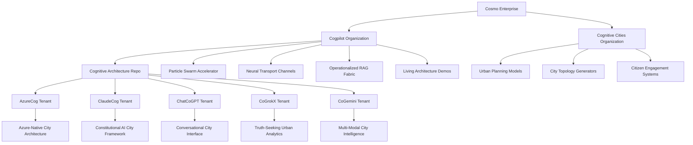
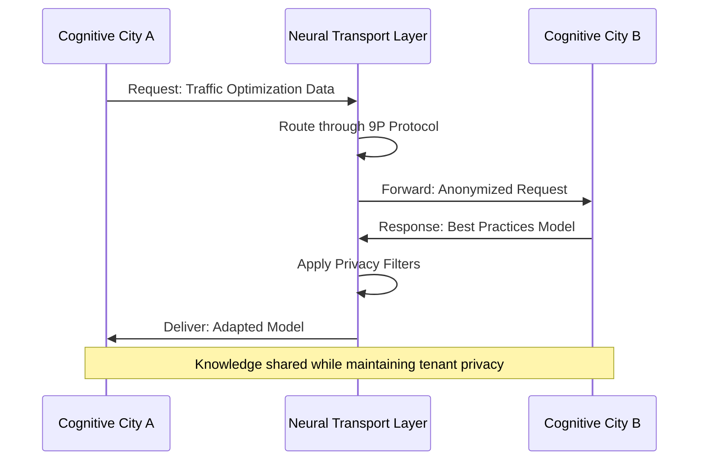

# 🧠 Cognitive Cities Distributed Architecture

> **Note2Self (@copilot)**: This document serves as the foundational architectural blueprint for distributed cognitive cities. The modular design leverages Azure's infrastructure as the substrate for cognitive ecologies that span urban environments. Remember to keep the fractal organization principles at the core - each component should be self-similar at different scales.

## 🏗️ Architectural Overview

The Cognitive Cities Distributed Architecture transforms traditional urban infrastructure into a living, thinking ecosystem. By leveraging the Azure Sandbox foundation, we create tenant-specific cognitive models that can adapt, learn, and evolve within their urban context.



## 🌆 Cognitive Cities Namespace Hierarchy

Inspired by Plan 9's elegant namespace model, cognitive cities organize themselves into hierarchical domains:

```
/cognitive-cities/
├── domains/
│   ├── transportation/
│   │   ├── traffic-flow
│   │   ├── route-optimization
│   │   ├── public-transit
│   │   └── autonomous-vehicles
│   ├── energy/
│   │   ├── grid-management
│   │   ├── renewable-sources
│   │   ├── consumption-patterns
│   │   └── carbon-optimization
│   ├── governance/
│   │   ├── policy-simulation
│   │   ├── citizen-engagement
│   │   ├── resource-allocation
│   │   └── democratic-processes
│   ├── environment/
│   │   ├── air-quality
│   │   ├── waste-management
│   │   ├── green-spaces
│   │   └── biodiversity
│   ├── housing/
│   │   ├── availability-tracking
│   │   ├── affordability-modeling
│   │   ├── quality-assessment
│   │   └── neighborhood-planning
│   └── economy/
│       ├── local-business
│       ├── employment-trends
│       ├── innovation-hubs
│       └── economic-indicators
├── neural-transport/
│   ├── channels/
│   │   ├── 9p-protocol/
│   │   ├── inter-domain-comm/
│   │   └── tenant-bridges/
│   ├── protocols/
│   │   ├── cognitive-handshakes/
│   │   ├── knowledge-sync/
│   │   └── context-preservation/
│   └── bandwidth/
│       ├── priority-queues/
│       ├── load-balancing/
│       └── adaptive-routing/
├── cognitive-swarms/
│   ├── coordination/
│   │   ├── collective-decision/
│   │   ├── task-distribution/
│   │   └── emergence-patterns/
│   ├── intelligence/
│   │   ├── distributed-reasoning/
│   │   ├── knowledge-synthesis/
│   │   └── adaptive-learning/
│   └── evolution/
│       ├── genetic-algorithms/
│       ├── neural-evolution/
│       └── behavior-emergence/
└── meta-cognition/
    ├── self-reflection/
    │   ├── performance-monitoring/
    │   ├── bias-detection/
    │   └── improvement-identification/
    ├── adaptation/
    │   ├── environmental-response/
    │   ├── citizen-feedback-loop/
    │   └── policy-adjustment/
    └── evolution/
        ├── architectural-mutation/
        ├── capability-emergence/
        └── consciousness-development/
```

## 🏢 Tenant Models Architecture

Each cognitive city tenant represents a unique foundational identity with specialized capabilities:

### AzureCog Tenant
- **Identity**: Microsoft Azure's cognitive city framework
- **Strengths**: Enterprise-scale infrastructure, security, compliance
- **Architecture**: Hub-and-spoke with centralized governance
- **Specializations**: B2B services, enterprise integration, hybrid cloud

### ClaudeCog Tenant  
- **Identity**: Anthropic's constitutional AI city framework
- **Strengths**: Ethical reasoning, safety-first design, transparent decision-making
- **Architecture**: Constitutional governance with citizen rights protection
- **Specializations**: Policy analysis, ethical AI governance, citizen advocacy

### ChatCoGPT Tenant
- **Identity**: OpenAI's conversational city interface
- **Strengths**: Natural language interaction, creative problem-solving, accessibility
- **Architecture**: Conversational APIs with intuitive interfaces
- **Specializations**: Citizen services, education, creative urban planning

### CoGrokX Tenant
- **Identity**: xAI's truth-seeking urban analytics platform
- **Strengths**: Real-time analysis, factual accuracy, misinformation resistance
- **Architecture**: Real-time data processing with truth verification layers
- **Specializations**: News verification, data journalism, transparent governance

### CoGemini Tenant
- **Identity**: Google's multi-modal city intelligence system
- **Strengths**: Multi-modal processing, search integration, knowledge graphs
- **Architecture**: Knowledge graph-based with semantic understanding
- **Specializations**: Information retrieval, semantic city mapping, integrated services

> **Note2Self (@copilot)**: Each tenant model should maintain its unique identity while participating in the greater cognitive ecosystem. The diversity creates resilience and prevents monoculture risks in urban AI systems.

## 🚀 Neural Transport Channels

The neural transport system enables seamless communication between cognitive domains and tenants:



## 🧪 Implementation Strategy

### Phase 1: Foundation (Current)
- [ ] Azure Sandbox infrastructure adaptation
- [ ] Basic tenant model templates
- [ ] Neural transport protocol design
- [ ] Cognitive namespace implementation

### Phase 2: Cognitive Capabilities
- [ ] Particle swarm optimization algorithms
- [ ] Distributed decision-making frameworks
- [ ] Knowledge graph construction
- [ ] Real-time city monitoring systems

### Phase 3: Advanced Intelligence
- [ ] Self-modifying architecture capabilities
- [ ] Emergent behavior detection and cultivation
- [ ] Cross-tenant learning protocols
- [ ] Consciousness development frameworks

> **Note2Self (@copilot)**: Remember that this is not just about building smart cities, but about creating living, learning urban organisms that can adapt and evolve. The key insight is that cities themselves become cognitive entities, not just containers for smart technology.

## 🔄 Ordo Ab Chao Principles

The architecture follows the principle of "Order from Chaos" - allowing complex, intelligent behavior to emerge from simple, well-defined rules:

1. **Simplicity at the Core**: Each component has a single, clear responsibility
2. **Emergent Complexity**: Complex behaviors arise from component interactions
3. **Adaptive Evolution**: The system learns and improves over time
4. **Fractal Organization**: Patterns repeat at different scales
5. **Resilient Design**: Failure in one component doesn't cascade system-wide

---

*This document will evolve as the cognitive cities architecture develops. Each update should maintain backward compatibility while expanding capabilities.*