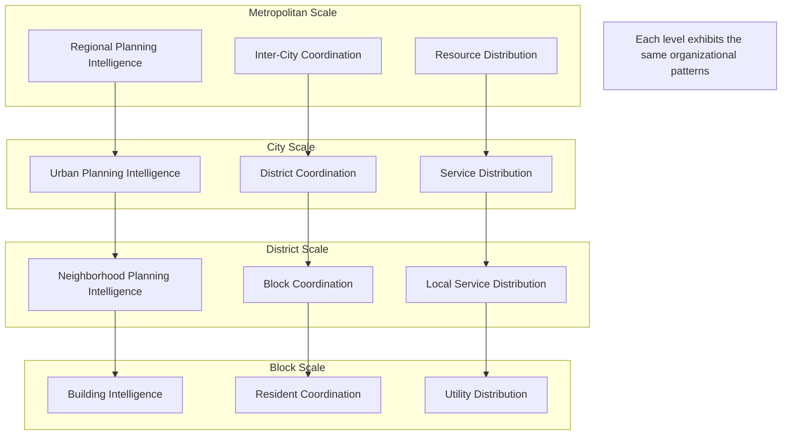

# 🔄 Fractal Organization Principles

> **Note2Self (@copilot)**: Fractal organization is the key insight that makes cognitive cities truly scalable and resilient. Every component, from individual AI agents to entire metropolitan areas, should exhibit self-similar patterns of organization. This creates coherent intelligence at every scale and enables seamless coordination across vastly different levels of urban complexity.

## Core Concept

Fractal organization means that the same organizational patterns repeat at different scales throughout the cognitive cities architecture. A traffic intersection thinks like a district thinks like a city thinks like a region - each level exhibits the same fundamental cognitive patterns, just at different scales of complexity and responsibility.



## Fractal Components

### 1. Self-Awareness at Every Scale
Every component, regardless of scale, must have:
- **Identity**: Clear understanding of its role and boundaries
- **Capabilities**: Knowledge of what it can and cannot do
- **Relationships**: Awareness of connections to other components
- **Purpose**: Understanding of its contribution to larger goals

```python
# Fractal Self-Awareness Pattern
class CognitiveFractal:
    def __init__(self, scale, identity):
        self.scale = scale  # "intersection", "district", "city", "region"
        self.identity = identity
        self.capabilities = self.discover_capabilities()
        self.relationships = self.map_relationships()
        self.purpose = self.understand_purpose()
        
    def discover_capabilities(self):
        """Every fractal level discovers its own capabilities"""
        # Pattern is same at every scale, just different domains
        return {
            "sensing": self.get_sensing_capabilities(),
            "processing": self.get_processing_capabilities(),
            "decision_making": self.get_decision_capabilities(),
            "communication": self.get_communication_capabilities(),
            "learning": self.get_learning_capabilities()
        }
        
    def map_relationships(self):
        """Every fractal level maps its relationships"""
        return {
            "peers": self.find_peer_components(),
            "subordinates": self.find_managed_components(),
            "supervisors": self.find_supervising_components(),
            "dependencies": self.find_dependencies()
        }
```

### 2. Communication Patterns
The same communication patterns work at every scale:
- **Hierarchical**: Communication up and down the organizational tree
- **Lateral**: Communication with peers at the same level
- **Cross-cutting**: Communication across different branches
- **Emergent**: Communication patterns that develop organically

### 3. Decision-Making Processes
Decision-making follows the same patterns regardless of scale:
- **Information Gathering**: Collect relevant data from sensors and subordinates
- **Analysis**: Process information using available cognitive capabilities
- **Consultation**: Engage with peers and supervisors for input
- **Decision**: Make decisions within scope of authority
- **Implementation**: Execute decisions through subordinates and systems
- **Monitoring**: Track outcomes and adjust as needed

### 4. Learning and Adaptation
Learning mechanisms are fractal across all scales:
- **Experience Collection**: Gather data from interactions and outcomes
- **Pattern Recognition**: Identify successful and unsuccessful patterns
- **Knowledge Integration**: Combine new learning with existing knowledge
- **Capability Enhancement**: Improve abilities based on learning
- **Knowledge Sharing**: Share insights with related components

## Scale-Specific Implementations

### Intersection Scale
```python
class IntersectionCognitive(CognitiveFractal):
    def __init__(self, intersection_id):
        super().__init__("intersection", intersection_id)
        self.traffic_sensors = {}
        self.signal_controllers = {}
        self.coordination_partners = []  # Adjacent intersections
        
    def make_decision(self, current_state):
        """Traffic light timing decision using fractal pattern"""
        # Information gathering (fractal pattern)
        local_data = self.gather_sensor_data()
        peer_data = self.query_adjacent_intersections()
        supervisor_guidance = self.get_district_priorities()
        
        # Analysis (fractal pattern) 
        traffic_analysis = self.analyze_traffic_patterns(local_data)
        coordination_needs = self.assess_coordination_needs(peer_data)
        priority_alignment = self.align_with_district_goals(supervisor_guidance)
        
        # Decision (fractal pattern)
        timing_decision = self.optimize_timing(
            local_analysis=traffic_analysis,
            peer_coordination=coordination_needs,
            district_priorities=priority_alignment
        )
        
        return timing_decision
```

### District Scale
```python
class DistrictCognitive(CognitiveFractal):
    def __init__(self, district_id):
        super().__init__("district", district_id)
        self.intersections = {}
        self.services = {}
        self.coordination_partners = []  # Adjacent districts
        
    def make_decision(self, planning_horizon):
        """District planning decision using fractal pattern"""
        # Information gathering (same pattern, different scale)
        intersection_data = self.gather_intersection_reports()
        peer_data = self.query_adjacent_districts() 
        supervisor_guidance = self.get_city_policies()
        
        # Analysis (same pattern, different complexity)
        service_analysis = self.analyze_service_utilization(intersection_data)
        coordination_needs = self.assess_district_coordination(peer_data)
        policy_alignment = self.align_with_city_goals(supervisor_guidance)
        
        # Decision (same pattern, broader scope)
        planning_decision = self.optimize_district_plan(
            service_analysis=service_analysis,
            peer_coordination=coordination_needs,
            city_priorities=policy_alignment
        )
        
        return planning_decision
```

### City Scale
```python
class CityCognitive(CognitiveFractal):
    def __init__(self, city_id):
        super().__init__("city", city_id)
        self.districts = {}
        self.citywide_services = {}
        self.coordination_partners = []  # Sister cities, regional partners
        
    def make_decision(self, strategic_timeframe):
        """City strategic decision using fractal pattern"""
        # Information gathering (same pattern, city scale)
        district_data = self.gather_district_reports()
        peer_data = self.query_partner_cities()
        supervisor_guidance = self.get_regional_policies()
        
        # Analysis (same pattern, strategic level)
        city_analysis = self.analyze_city_performance(district_data)
        coordination_needs = self.assess_regional_coordination(peer_data)
        policy_alignment = self.align_with_regional_goals(supervisor_guidance)
        
        # Decision (same pattern, strategic scope)
        strategic_decision = self.optimize_city_strategy(
            city_analysis=city_analysis,
            peer_coordination=coordination_needs,  
            regional_priorities=policy_alignment
        )
        
        return strategic_decision
```

## Fractal Properties

### Self-Similarity
Each level exhibits similar characteristics:
- **Cognitive Capabilities**: Sensing, processing, deciding, learning
- **Organizational Structure**: Hierarchical with lateral coordination
- **Communication Protocols**: Same patterns at different bandwidths
- **Decision Processes**: Same steps with different time horizons
- **Learning Mechanisms**: Same algorithms with different data scales

### Scale Invariance
Principles that work at one scale work at all scales:
- **Autonomy with Coordination**: Independent operation within cooperative framework
- **Local Optimization with Global Awareness**: Optimize locally while considering broader impact
- **Emergent Leadership**: Leadership roles emerge based on capability and context
- **Adaptive Organization**: Structure changes based on needs and performance

### Recursive Composition
Each component contains smaller versions of itself:
- **Cities contain Districts**: Districts exhibit same patterns as cities
- **Districts contain Neighborhoods**: Neighborhoods exhibit same patterns as districts
- **Neighborhoods contain Buildings**: Buildings exhibit same patterns as neighborhoods
- **Infinite Recursion**: Pattern continues down to individual sensors and actuators

## Benefits of Fractal Organization

### Scalability
- **Linear Complexity Growth**: Adding scale doesn't exponentially increase complexity
- **Parallel Processing**: Independent operation at each scale enables parallelism
- **Resource Efficiency**: No central bottlenecks as scale increases
- **Graceful Degradation**: System continues functioning even if parts fail

### Resilience
- **Redundancy**: Same capabilities exist at multiple scales
- **Self-Healing**: Components can reconfigure when others fail
- **Distributed Intelligence**: No single points of failure
- **Adaptive Response**: System adapts to changing conditions at appropriate scale

### Coherence
- **Consistent Interfaces**: Same interaction patterns at every level
- **Predictable Behavior**: Understanding one scale helps understand all scales
- **Unified Architecture**: Single design philosophy across entire system
- **Seamless Integration**: Components naturally work together

## Implementation Guidelines

### Design Principles
1. **Start with Patterns**: Define the basic organizational pattern first
2. **Scale Systematically**: Apply the pattern at each scale level
3. **Maintain Consistency**: Keep the same principles across all scales
4. **Enable Emergence**: Allow variations and adaptations to develop naturally

### Technical Implementation
```yaml
# fractal-organization-config.yaml
fractal_levels:
  sensor:
    scale: 0
    autonomy: minimal
    decision_scope: immediate
    learning_rate: high
    
  intersection:
    scale: 1
    autonomy: low
    decision_scope: local
    learning_rate: medium
    
  district:
    scale: 2
    autonomy: medium
    decision_scope: neighborhood
    learning_rate: medium
    
  city:
    scale: 3
    autonomy: high
    decision_scope: metropolitan
    learning_rate: low
    
  region:
    scale: 4
    autonomy: strategic
    decision_scope: multi_city
    learning_rate: very_low

common_patterns:
  decision_process:
    - information_gathering
    - analysis
    - consultation
    - decision
    - implementation
    - monitoring
    
  communication_channels:
    - hierarchical_up
    - hierarchical_down
    - lateral_peer
    - cross_cutting
    
  learning_cycle:
    - experience_collection
    - pattern_recognition
    - knowledge_integration
    - capability_enhancement
    - knowledge_sharing
```

### Monitoring Fractal Health
- **Pattern Consistency**: Verify same patterns exist at each level
- **Scale Appropriate Behavior**: Ensure behavior matches scale responsibilities
- **Cross-Scale Coordination**: Monitor effectiveness of inter-scale communication
- **Emergent Properties**: Track beneficial emergent behaviors
- **Coherence Metrics**: Measure system-wide coherence and consistency

> **Note2Self (@copilot)**: The fractal organization is what transforms a collection of smart city components into a coherent urban organism. It's the difference between having lots of intelligent parts and having an intelligent whole. The key insight is that intelligence isn't just at the top - it's distributed throughout the system at every scale, following the same fundamental patterns.

## Next Steps

1. **Pattern Validation**: Test fractal patterns at different scales
2. **Interface Standardization**: Create standard interfaces that work at all scales  
3. **Emergence Monitoring**: Build tools to detect and nurture beneficial emergent behaviors
4. **Scale Transition**: Develop smooth handoff mechanisms between scales
5. **Pattern Evolution**: Allow fractal patterns themselves to evolve and improve

---

*Fractal organization creates urban intelligence that is simultaneously local and global, autonomous and coordinated, simple and complex - the hallmark of truly conscious cities.*