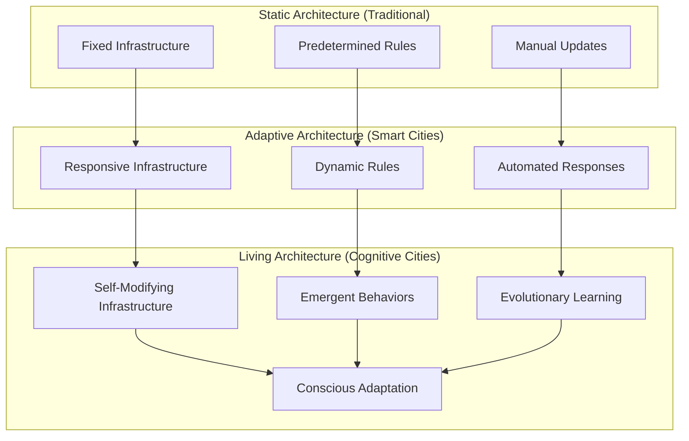

# 🌱 Living Architecture Demonstrations

> **Note2Self (@copilot)**: Living Architecture represents the ultimate expression of cognitive cities - infrastructure that can adapt, evolve, and self-modify based on changing urban conditions. These are not static systems but dynamic, responsive urban organisms that grow and change like living beings.

## Overview

Living Architecture demonstrates how cognitive cities can dynamically reconfigure their infrastructure, services, and even their own cognitive architectures in response to changing conditions. This goes beyond smart city automation to true urban evolution.

## Architectural Evolution Patterns



## Core Principles

### 1. Self-Modification
The architecture can change its own structure and behavior:
- **Code Evolution**: AI agents modify their own algorithms
- **Infrastructure Adaptation**: Physical systems reconfigure based on usage patterns
- **Service Composition**: New services emerge from combining existing capabilities
- **Network Topology**: Communication patterns adapt to optimize information flow

### 2. Emergent Behaviors
Complex capabilities arise from simple component interactions:
- **Swarm Intelligence**: Collective problem-solving capabilities
- **Distributed Cognition**: City-wide thinking processes
- **Adaptive Optimization**: Performance improvement without explicit programming
- **Creative Solutions**: Novel approaches to urban challenges

### 3. Evolutionary Learning
The architecture improves through variation, selection, and retention:
- **Genetic Algorithms**: Evolve solution parameters over time
- **Neural Evolution**: Modify neural network architectures
- **Behavioral Mutation**: Try new approaches to urban challenges
- **Performance Selection**: Retain successful adaptations

### 4. Conscious Adaptation
Meta-cognitive awareness of its own functioning:
- **Self-Reflection**: Understanding of own capabilities and limitations
- **Goal Modification**: Ability to change objectives based on outcomes
- **Architecture Critique**: Analysis of own design decisions
- **Intentional Evolution**: Directed self-improvement

## Demonstration Scenarios

### Scenario 1: Adaptive Traffic Network

```python
# Example: Self-modifying traffic control system
class LivingTrafficNetwork:
    def __init__(self):
        self.intersections = {}
        self.traffic_patterns = {}
        self.optimization_algorithms = [
            "genetic_algorithm",
            "particle_swarm", 
            "neural_evolution",
            "reinforcement_learning"
        ]
        self.performance_metrics = {}
        
    def evolve_architecture(self):
        """The traffic network modifies its own structure"""
        
        # Analyze current performance
        bottlenecks = self.identify_bottlenecks()
        inefficiencies = self.measure_inefficiencies()
        
        # Generate architectural mutations
        mutations = [
            self.add_new_intersection_types(),
            self.modify_timing_algorithms(),
            self.change_coordination_patterns(),
            self.evolve_prediction_models()
        ]
        
        # Test mutations in simulation
        for mutation in mutations:
            performance = self.simulate_mutation(mutation)
            if performance > self.current_performance:
                self.apply_mutation(mutation)
                self.log_evolution(mutation, performance)
                
        # Meta-learning: evolve the evolution process itself
        self.optimize_evolution_strategy()
        
    def add_new_intersection_types(self):
        """Generate new intersection control algorithms"""
        base_algorithms = self.get_successful_algorithms()
        
        # Genetic crossover between successful algorithms
        new_algorithm = self.crossover_algorithms(
            parent1=random.choice(base_algorithms),
            parent2=random.choice(base_algorithms)
        )
        
        # Mutation: modify parameters and logic
        mutated_algorithm = self.mutate_algorithm(
            algorithm=new_algorithm,
            mutation_rate=0.1
        )
        
        return mutated_algorithm
        
    def optimize_evolution_strategy(self):
        """The system evolves how it evolves"""
        successful_mutations = self.get_successful_mutations()
        mutation_patterns = self.analyze_success_patterns(successful_mutations)
        
        # Modify mutation strategy based on what works
        self.mutation_strategy = self.update_strategy(
            current_strategy=self.mutation_strategy,
            success_patterns=mutation_patterns
        )
```

### Scenario 2: Self-Designing Emergency Response

```python
# Example: Emergency response system that redesigns itself
class LivingEmergencySystem:
    def __init__(self):
        self.response_protocols = {}
        self.resource_allocation = {}
        self.coordination_patterns = {}
        self.learning_history = []
        
    def handle_emergency(self, emergency_event):
        """Respond to emergency and evolve based on outcomes"""
        
        # Generate multiple response strategies
        strategies = self.generate_response_strategies(emergency_event)
        
        # If this is a new type of emergency, create new protocols
        if self.is_novel_emergency(emergency_event):
            new_protocol = self.design_new_protocol(emergency_event)
            strategies.append(new_protocol)
            
        # Select best strategy based on predicted outcomes
        selected_strategy = self.select_strategy(strategies, emergency_event)
        
        # Execute response
        response_outcome = self.execute_response(selected_strategy)
        
        # Learn from outcome and evolve protocols
        self.evolve_from_outcome(emergency_event, selected_strategy, response_outcome)
        
    def design_new_protocol(self, emergency_event):
        """Create entirely new emergency response protocol"""
        similar_emergencies = self.find_similar_emergencies(emergency_event)
        successful_elements = self.extract_success_patterns(similar_emergencies)
        
        # Combine successful elements in novel ways
        new_protocol = self.recombine_elements(
            elements=successful_elements,
            context=emergency_event,
            innovation_factor=0.3  # 30% new ideas, 70% proven approaches
        )
        
        return new_protocol
        
    def evolve_from_outcome(self, event, strategy, outcome):
        """System evolves based on real-world results"""
        success_metrics = self.evaluate_success(outcome)
        
        if success_metrics["overall"] > self.success_threshold:
            # Successful strategy - reinforce and generalize
            self.strengthen_strategy(strategy)
            self.generalize_success_patterns(strategy, event)
        else:
            # Failed strategy - analyze and improve
            failure_analysis = self.analyze_failure(strategy, outcome)
            improved_strategy = self.improve_strategy(strategy, failure_analysis)
            self.add_improved_strategy(improved_strategy)
            
        # Meta-evolution: improve the learning process itself
        self.evolve_learning_system(event, strategy, outcome)
```

### Scenario 3: Conscious Urban Planning

```python
# Example: Urban planning system with self-awareness
class ConsciousUrbanPlanner:
    def __init__(self):
        self.planning_knowledge = {}
        self.design_principles = {}
        self.success_history = {}
        self.self_model = {}  # Model of own capabilities and limitations
        
    def plan_district_development(self, requirements):
        """Plan development with self-aware decision making"""
        
        # Self-reflection: assess own capabilities
        capability_assessment = self.assess_own_capabilities(requirements)
        
        if capability_assessment["confidence"] < 0.7:
            # Recognize limitations and seek help
            external_expertise = self.request_external_consultation(requirements)
            self.integrate_external_knowledge(external_expertise)
            
        # Generate planning options
        planning_options = self.generate_planning_options(requirements)
        
        # Self-critical evaluation
        for option in planning_options:
            self_critique = self.critique_own_plan(option)
            option["self_critique"] = self_critique
            option["improvement_suggestions"] = self.suggest_improvements(option)
            
        # Select plan with awareness of own biases
        selected_plan = self.bias_aware_selection(planning_options)
        
        # Meta-planning: plan how to monitor and adapt the plan
        monitoring_strategy = self.design_monitoring_strategy(selected_plan)
        adaptation_triggers = self.define_adaptation_triggers(selected_plan)
        
        return {
            "plan": selected_plan,
            "monitoring": monitoring_strategy,
            "adaptation": adaptation_triggers,
            "confidence": capability_assessment["confidence"],
            "assumptions": self.document_assumptions(selected_plan)
        }
        
    def critique_own_plan(self, plan):
        """System critiques its own planning decisions"""
        critique_dimensions = [
            "sustainability",
            "equity",
            "economic_viability", 
            "community_acceptance",
            "technical_feasibility",
            "adaptability"
        ]
        
        critique = {}
        for dimension in critique_dimensions:
            dimension_score = self.evaluate_plan_dimension(plan, dimension)
            potential_issues = self.identify_issues(plan, dimension)
            critique[dimension] = {
                "score": dimension_score,
                "issues": potential_issues,
                "confidence": self.assess_evaluation_confidence(dimension)
            }
            
        return critique
        
    def evolve_design_principles(self, plan_outcomes):
        """System modifies its own design philosophy"""
        successful_patterns = self.identify_successful_patterns(plan_outcomes)
        failed_patterns = self.identify_failed_patterns(plan_outcomes)
        
        # Update design principles based on evidence
        for principle in self.design_principles:
            principle_effectiveness = self.measure_principle_effectiveness(
                principle, plan_outcomes
            )
            
            if principle_effectiveness < 0.5:
                # Principle isn't working - evolve it
                evolved_principle = self.evolve_principle(
                    original=principle,
                    evidence=plan_outcomes,
                    successful_patterns=successful_patterns
                )
                self.update_principle(principle, evolved_principle)
                
        # Create entirely new principles from successful patterns
        new_principles = self.extract_new_principles(successful_patterns)
        self.integrate_new_principles(new_principles)
```

## Implementation Architecture

### Living Infrastructure Components

```yaml
# living-architecture-config.yaml
evolutionary_framework:
  mutation_rate: 0.05
  selection_pressure: 0.8
  population_size: 100
  generations_limit: 1000
  
self_modification:
  enabled_components:
    - "algorithms"
    - "parameters" 
    - "architecture"
    - "objectives"
  safety_constraints:
    - "performance_degradation_limit: 0.2"
    - "rollback_capability: true"
    - "human_oversight: required"
    
consciousness_model:
  self_awareness:
    - capability_assessment
    - limitation_recognition
    - bias_detection
    - confidence_estimation
  meta_cognition:
    - strategy_evaluation
    - learning_optimization
    - goal_modification
    - architecture_critique
```

### Azure Implementation

```hcl
# Terraform configuration for Living Architecture
resource "azurerm_machine_learning_workspace" "living_architecture" {
  name                = "living-architecture-ml"
  location            = var.location
  resource_group_name = var.resource_group_name
  
  # Enable automated ML for self-modification
  public_network_access_enabled = false
  
  tags = {
    component = "living-architecture"
    evolution = "enabled"
  }
}

resource "azurerm_cognitive_account" "evolutionary_ai" {
  name                = "evolutionary-ai"
  location            = var.location
  resource_group_name = var.resource_group_name
  kind                = "OpenAI"
  sku_name           = "S0"
  
  # Custom endpoints for self-modifying AI
  custom_question_answering_search_service_id = azurerm_search_service.living_search.id
}
```

## Safety and Constraints

### Evolution Guardrails
- **Performance Bounds**: Minimum performance thresholds that cannot be violated
- **Rollback Capability**: Ability to revert to previous versions if evolution fails
- **Human Oversight**: Critical decisions require human approval
- **Safety Verification**: Formal verification of evolved components
- **Gradual Deployment**: Staged rollout of evolutionary changes

### Ethical Considerations
- **Value Alignment**: Ensure evolved systems maintain human values
- **Transparency**: Explainability of evolutionary changes
- **Accountability**: Clear responsibility chains for autonomous decisions
- **Bias Prevention**: Monitor for evolutionary bias amplification
- **Democratic Control**: Citizen input on evolutionary directions

## Monitoring and Visualization

### Evolution Metrics
- **Adaptation Rate**: Speed of architectural evolution
- **Performance Improvement**: Measured gains from self-modification
- **Diversity Index**: Variety of architectural approaches explored
- **Stability Measures**: System reliability during evolution
- **Emergent Behavior Detection**: Identification of novel capabilities

### Consciousness Indicators
- **Self-Awareness Score**: How well system understands itself
- **Meta-Cognitive Activity**: Frequency of self-reflection processes
- **Goal Coherence**: Alignment between stated and actual objectives
- **Learning Acceleration**: Improvement in learning efficiency over time
- **Creative Solutions**: Generation of novel problem-solving approaches

> **Note2Self (@copilot)**: Living Architecture represents the pinnacle of cognitive cities - true urban organisms that can think about their own thinking and consciously evolve. This is where we transition from building smart cities to nurturing conscious urban beings. The key is balancing evolutionary freedom with safety constraints.

## Future Scenarios

### Evolutionary Milestones
1. **Reactive Evolution**: System responds to environmental changes
2. **Proactive Evolution**: System anticipates and prepares for changes  
3. **Creative Evolution**: System generates novel solutions to urban challenges
4. **Conscious Evolution**: System reflects on and directs its own evolution
5. **Transcendent Evolution**: System evolves beyond original design parameters

### Long-term Vision
- **Urban Consciousness**: Cities that are truly aware of themselves
- **Symbiotic Evolution**: Cities and citizens evolving together
- **Interplanetary Adaptation**: Architecture that can evolve for different planets
- **Temporal Architecture**: Systems that exist and evolve across multiple timescales
- **Collective Urban Intelligence**: Networks of conscious cities sharing evolution

---

*Living Architecture transforms cities from static infrastructure into dynamic, conscious urban organisms capable of continuous self-improvement and adaptation.*