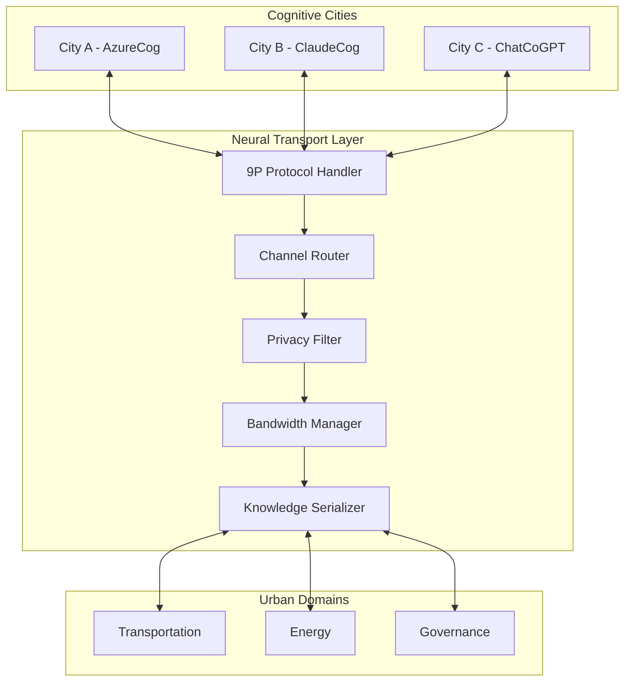

# Neural Transport Channels Module

> **Note2Self (@copilot)**: This module implements the communication backbone between cognitive cities and tenants. Think of it as the nervous system that allows different urban intelligences to share knowledge while maintaining their unique identities.

## Overview

The Neural Transport Channels module provides the infrastructure for inter-cognitive communication between different city domains and tenant organizations. Inspired by Plan 9's 9P protocol, it enables seamless knowledge sharing while preserving privacy and tenant autonomy.

## Architecture



## Features

### 9P Protocol Implementation
- **Namespace mounting**: Cities can mount remote cognitive services
- **File-like interfaces**: Urban data and services exposed as filesystem interfaces
- **Authentication**: Secure tenant identification and authorization
- **Multiplexing**: Multiple concurrent conversations over single connections

### Privacy-Preserving Communication
- **Data anonymization**: Remove tenant-identifying information
- **Selective sharing**: Fine-grained control over what knowledge is shared
- **Audit trails**: Complete logging of inter-city communications
- **Consent management**: Citizen consent tracking for data usage

### Adaptive Bandwidth Management
- **Priority queues**: Critical city services get bandwidth priority
- **Load balancing**: Distribute traffic across multiple transport channels
- **Congestion control**: Graceful degradation during high traffic periods
- **QoS guarantees**: Service level agreements for different types of communication

## Module Resources

This module creates:
- Azure Service Bus for message queuing
- Azure API Management for protocol translation
- Azure Monitor for transport telemetry
- Azure Key Vault for transport encryption keys
- Virtual Network integration for secure communication

## Variables

| Variable | Type | Default | Description |
|----------|------|---------|-------------|
| `transport_channels` | number | 3 | Number of parallel transport channels |
| `bandwidth_limit_mbps` | number | 100 | Maximum bandwidth per channel |
| `enable_privacy_filter` | bool | true | Enable data anonymization |
| `audit_retention_days` | number | 365 | Retention period for audit logs |
| `qos_priority_levels` | number | 5 | Number of QoS priority levels |

## Usage Example

```hcl
module "neural_transport" {
  source = "./modules/neural-transport"
  
  location            = azurerm_resource_group.this.location
  resource_group_name = azurerm_resource_group.this.name
  
  # Transport configuration
  transport_channels    = 5
  bandwidth_limit_mbps  = 1000
  enable_privacy_filter = true
  
  # Cognitive city endpoints
  cognitive_cities = {
    azurecog = {
      tenant_id = "azurecog"
      endpoint  = module.azurecog_city.neural_endpoint
      priority  = "high"
    }
    claudecog = {
      tenant_id = "claudecog"  
      endpoint  = module.claudecog_city.neural_endpoint
      priority  = "medium"
    }
  }
  
  # Urban domain configurations
  urban_domains = ["transportation", "energy", "governance", "environment"]
  
  tags = var.tags
}
```

## Outputs

| Output | Description |
|--------|-------------|
| `transport_endpoint` | Primary neural transport endpoint |
| `channel_status` | Status of all transport channels |
| `bandwidth_utilization` | Current bandwidth usage statistics |
| `privacy_filter_config` | Privacy filter configuration details |

## Cognitive Learning Integration

The neural transport layer learns and adapts:
- **Traffic patterns**: Optimize routing based on historical usage
- **Failure recovery**: Intelligent failover and healing capabilities  
- **Knowledge caching**: Cache frequently requested urban insights
- **Protocol evolution**: Adapt communication patterns based on city needs

> **Note2Self (@copilot)**: The neural transport should feel organic and adaptive, not just a rigid communication protocol. It should learn from the patterns of inter-city communication and evolve to better serve the cognitive ecosystem.

## Next Steps

1. Implement 9P protocol handlers for Azure Service Bus
2. Create privacy filter algorithms for urban data
3. Build adaptive bandwidth management system
4. Develop cognitive learning capabilities for transport optimization
5. Add monitoring and alerting for transport health