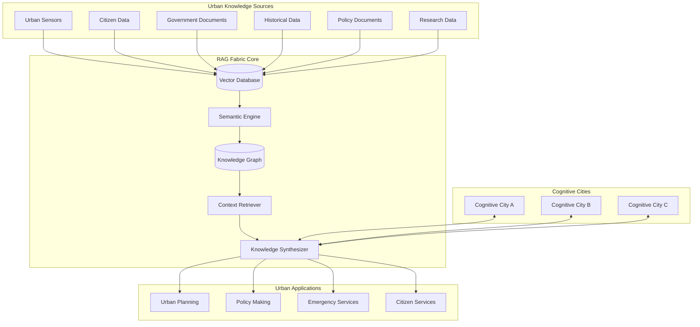

# 🕸️ Operationalized RAG Fabric - Urban Knowledge Synthesis

> **Note2Self (@copilot)**: The RAG (Retrieval-Augmented Generation) fabric is the memory and knowledge synthesis system of cognitive cities. Think of it as the city's long-term memory that can be queried, updated, and reasoned over. This isn't just document storage - it's living urban knowledge that grows and evolves.

## Overview

The Operationalized RAG Fabric creates a distributed knowledge system that allows cognitive cities to:
- **Store and retrieve** urban experiences and solutions
- **Synthesize knowledge** across different domains and timeframes  
- **Learn from other cities** while preserving local context
- **Generate insights** by combining historical data with real-time observations
- **Maintain context** across long-term urban planning cycles

## Architecture



## Core Components

### 1. Urban Vector Database
- **Embeddings**: Multi-modal embeddings for text, images, sensor data, and spatial information
- **Semantic Search**: Context-aware retrieval of relevant urban knowledge
- **Temporal Indexing**: Knowledge organized by time for historical analysis
- **Spatial Indexing**: Geographically-aware knowledge retrieval
- **Federated Storage**: Distributed across multiple cognitive cities

### 2. Urban Knowledge Graph
- **Entities**: People, places, events, policies, infrastructure, organizations
- **Relationships**: Causal links, dependencies, influences, correlations
- **Temporal Edges**: How relationships change over time
- **Uncertainty Modeling**: Confidence levels and probabilistic relationships
- **Dynamic Updates**: Real-time graph updates from city operations

### 3. Context-Aware Retrieval
- **Multi-hop Reasoning**: Follow relationship chains to find relevant context
- **Temporal Context**: Consider historical patterns and seasonal variations
- **Spatial Context**: Geographic proximity and administrative boundaries
- **Social Context**: Community demographics and cultural factors
- **Policy Context**: Regulatory constraints and government priorities

### 4. Knowledge Synthesis Engine
- **Multi-source Integration**: Combine information from different data types
- **Conflict Resolution**: Handle contradictory information intelligently
- **Gap Identification**: Detect missing information needed for decisions
- **Scenario Generation**: Create possible future scenarios based on knowledge
- **Explanation Generation**: Provide reasoning for recommendations

## Urban Applications

### Transportation Planning
```python
# Example: RAG-assisted traffic optimization
def optimize_traffic_flow(location, time_context):
    # Retrieve relevant historical patterns
    historical_patterns = rag_fabric.retrieve(
        query="traffic patterns similar to {location} at {time_context}",
        sources=["traffic_sensors", "event_data", "weather_data"],
        temporal_window="last_2_years"
    )
    
    # Get knowledge from similar cities
    similar_cities = rag_fabric.retrieve(
        query="successful traffic solutions for similar urban contexts",
        scope="global_knowledge",
        filters={"city_size": "similar", "demographics": "similar"}
    )
    
    # Synthesize recommendations
    recommendations = knowledge_synthesizer.generate(
        context=f"Current situation at {location}",
        historical_data=historical_patterns,
        best_practices=similar_cities,
        constraints=["budget", "existing_infrastructure", "citizen_impact"]
    )
    
    return recommendations
```

### Policy Development
```python
# Example: RAG-assisted policy impact analysis
def analyze_policy_impact(proposed_policy):
    # Retrieve similar policies from other jurisdictions
    similar_policies = rag_fabric.retrieve(
        query=f"policies similar to {proposed_policy.description}",
        sources=["policy_documents", "legislation", "case_studies"],
        scope="global"
    )
    
    # Get local context and constraints
    local_context = rag_fabric.retrieve(
        query="local demographics, economics, and political context",
        sources=["census_data", "economic_indicators", "election_data"],
        geographic_scope="local"
    )
    
    # Predict impacts using knowledge synthesis
    impact_analysis = knowledge_synthesizer.predict_impacts(
        policy=proposed_policy,
        similar_outcomes=similar_policies,
        local_factors=local_context,
        stakeholder_concerns=["citizens", "businesses", "environment"]
    )
    
    return impact_analysis
```

### Emergency Response
```python
# Example: RAG-assisted emergency response
def emergency_response_plan(emergency_type, location, severity):
    # Retrieve historical emergency responses
    historical_responses = rag_fabric.retrieve(
        query=f"{emergency_type} responses in similar contexts",
        sources=["emergency_logs", "response_reports", "outcome_data"],
        filters={"severity": severity, "context": "urban"}
    )
    
    # Get real-time city state
    current_resources = rag_fabric.retrieve(
        query="current emergency resources and availability",
        sources=["asset_tracking", "personnel_status", "equipment_status"],
        temporal_filter="now"
    )
    
    # Generate response plan
    response_plan = knowledge_synthesizer.create_plan(
        emergency_context={"type": emergency_type, "location": location, "severity": severity},
        proven_strategies=historical_responses,
        available_resources=current_resources,
        success_metrics=["response_time", "casualties_prevented", "cost_efficiency"]
    )
    
    return response_plan
```

## Implementation Architecture

### Azure Components
- **Azure Cognitive Search**: Vector database for semantic search
- **Azure Cosmos DB**: Knowledge graph storage with Gremlin API
- **Azure OpenAI**: Embedding generation and knowledge synthesis
- **Azure Data Factory**: ETL pipelines for knowledge ingestion
- **Azure Synapse**: Analytics and knowledge graph processing
- **Azure Event Hubs**: Real-time data streaming for dynamic updates

### RAG Fabric Configuration
```yaml
# rag-fabric-config.yaml
vector_database:
  embedding_model: "text-embedding-ada-002"
  dimensions: 1536
  index_type: "hnsw"
  distance_metric: "cosine"
  
knowledge_graph:
  backend: "cosmos_gremlin"
  consistency: "session"
  partition_strategy: "geographic"
  
retrieval:
  max_results: 50
  similarity_threshold: 0.7
  temporal_decay: 0.1
  spatial_weight: 0.3
  
synthesis:
  model: "gpt-4"
  temperature: 0.3
  max_tokens: 2000
  reasoning_steps: 5
```

### Data Sources Integration
```json
{
  "data_sources": {
    "real_time": {
      "traffic_sensors": {
        "update_frequency": "30_seconds",
        "embedding_model": "multimodal",
        "retention": "2_years"
      },
      "social_media": {
        "update_frequency": "5_minutes", 
        "sentiment_analysis": true,
        "privacy_filter": "strict"
      }
    },
    "historical": {
      "city_documents": {
        "processing": "batch_weekly",
        "ocr_enabled": true,
        "language_detection": true
      },
      "research_papers": {
        "sources": ["academic_databases", "government_reports"],
        "citation_tracking": true,
        "peer_review_weight": "high"
      }
    }
  }
}
```

## Privacy and Security

### Privacy-Preserving RAG
- **Differential Privacy**: Add noise to aggregated queries
- **Federated Learning**: Train models without centralizing sensitive data
- **Selective Sharing**: Citizens control what knowledge can be shared
- **Anonymization**: Remove personally identifiable information from embeddings

### Security Measures
- **Access Controls**: Role-based access to different knowledge domains
- **Audit Logging**: Complete trail of all knowledge access and modifications
- **Encryption**: At-rest and in-transit encryption for all knowledge
- **Integrity Verification**: Cryptographic proofs of knowledge authenticity

## Cognitive Learning Integration

### Knowledge Evolution
- **Concept Drift Detection**: Identify when urban patterns change
- **Knowledge Pruning**: Remove outdated or incorrect information
- **Relationship Learning**: Discover new connections in urban data
- **Predictive Modeling**: Forecast urban trends from historical knowledge

### Cross-City Learning
- **Knowledge Distillation**: Extract generalizable insights from city-specific data
- **Transfer Learning**: Adapt solutions from one city to another
- **Collaborative Filtering**: Cities recommend relevant knowledge to each other
- **Ensemble Reasoning**: Combine insights from multiple cities for better decisions

## Performance Monitoring

### RAG Fabric Metrics
- **Retrieval Accuracy**: Relevance of retrieved knowledge to queries
- **Synthesis Quality**: Coherence and usefulness of generated insights
- **Knowledge Coverage**: Completeness of urban knowledge representation
- **Update Latency**: Time from real-world events to knowledge integration
- **Cross-City Knowledge Flow**: Effectiveness of inter-city learning

### Urban Impact Metrics
- **Decision Support Quality**: How well RAG fabric assists urban decisions
- **Citizen Satisfaction**: Improved services enabled by knowledge synthesis
- **Policy Effectiveness**: Better outcomes from RAG-informed policies
- **Emergency Response**: Faster and more effective emergency responses
- **Innovation Acceleration**: New urban solutions enabled by knowledge synthesis

> **Note2Self (@copilot)**: The RAG fabric is what transforms cognitive cities from reactive systems to truly intelligent urban organisms. It's not just about storing information - it's about creating living memory that can reason, learn, and synthesize new knowledge. This is where the city develops its long-term thinking capabilities.

## Next Steps

1. **Implement Vector Database**: Set up Azure Cognitive Search with urban embeddings
2. **Build Knowledge Graph**: Create Cosmos DB Gremlin instance with urban ontology
3. **Develop Retrieval Pipelines**: Context-aware knowledge retrieval systems
4. **Create Synthesis Engine**: GPT-4 based knowledge synthesis for urban insights
5. **Establish Privacy Framework**: Implement privacy-preserving knowledge sharing
6. **Deploy Monitoring**: Comprehensive observability for RAG fabric performance

---

*The operationalized RAG fabric transforms fragmented urban data into coherent, actionable urban intelligence.*