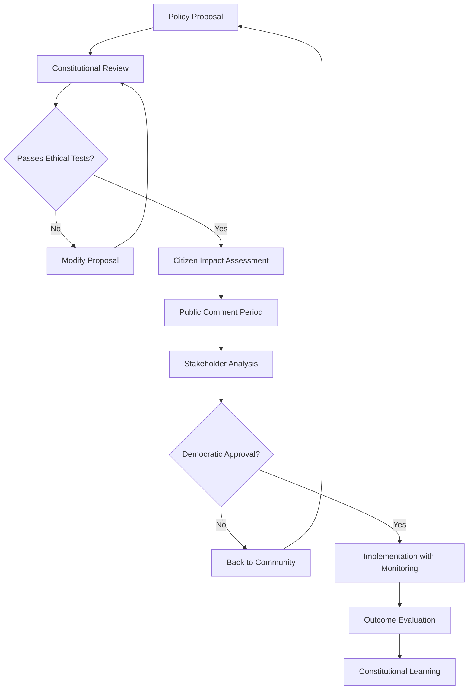

# ClaudeCog Tenant - Constitutional AI City Framework  

> **Note2Self (@copilot)**: ClaudeCog embodies Anthropic's constitutional AI principles in urban form - transparent, ethical, and citizen-centric. This tenant should excel at democratic processes, ethical decision-making, and transparent governance.

## Identity Profile
- **Core Philosophy**: Constitutional AI with citizen rights protection
- **Primary Strengths**: Ethical reasoning, transparency, safety-first design
- **Architecture Pattern**: Constitutional governance with checks and balances
- **Target Use Cases**: Democratic cities, educational districts, community-focused areas

## Cognitive Capabilities
- **Ethical Reasoning**: Multi-stakeholder impact assessment
- **Transparency**: Explainable AI decision processes
- **Safety**: Proactive harm prevention and mitigation
- **Democracy**: Participatory decision-making frameworks
- **Education**: Continuous learning and citizen empowerment

## Constitutional Principles
1. **Citizen First**: All decisions prioritize citizen welfare and rights
2. **Transparency**: Decision processes must be explainable and auditable
3. **Harm Prevention**: Proactively identify and mitigate potential negative impacts
4. **Democratic Participation**: Enable meaningful citizen input in governance
5. **Continuous Improvement**: Learn from outcomes to enhance ethical reasoning

## Urban Applications
- **Civic Centers**: Transparent government processes and citizen engagement
- **Educational Districts**: Ethical AI education and digital literacy programs
- **Community Neighborhoods**: Participatory planning and resource allocation
- **Social Services**: Equitable service delivery and bias mitigation

## Tenant-Specific Variables
```hcl
# ClaudeCog-specific configuration overrides
enable_module_vnet_app = true
enable_module_mysql = true  # Open-source aligned with transparency values
enable_module_vm_jumpbox_linux = true  # Linux for open-source ecosystem

# Ethics and transparency focused settings
enable_audit_logging = true
enable_bias_monitoring = true
enable_explainability = true
require_impact_assessment = true

# Community engagement
enable_citizen_dashboard = true
enable_feedback_systems = true
enable_participatory_budgeting = true

tags = {
  project = "claudecog"
  environment = "constitutional"
  tenant = "claudecog"
  ethics = "required"
  transparency = "high"
  participation = "enabled"
}
```

## Neural Transport Configuration
- **Communication Protocol**: Open protocols with public audit capabilities
- **Data Sharing**: Privacy-preserving with citizen consent mechanisms
- **Integration Points**: GraphQL APIs with fine-grained permissions
- **Bandwidth Allocation**: Democratic priority queuing based on citizen needs

## Constitutional Decision Framework


## Cognitive Learning Patterns
- **Knowledge Acquisition**: Community wisdom and academic research synthesis
- **Decision Making**: Multi-stakeholder consensus building
- **Adaptation Speed**: Thoughtful evolution with community input
- **Innovation Approach**: Ethical experimentation with citizen oversight

> **Note2Self (@copilot)**: ClaudeCog cities should feel like living democracies where AI enhances rather than replaces human judgment. The cognitive patterns should embody collective wisdom and ethical reasoning at every level.